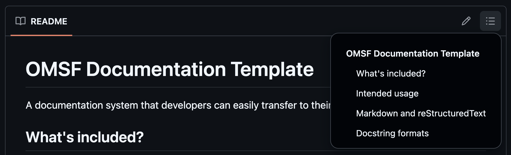

GitHub will automatically generate a TOC based on the headings in your README.md file, you can see it by clicking the menu icon in the upper right-hand corner of the README: 

However, it's still good practice to have a TOC in the README itself for users who will be viewing it in other locations. You can do this easily by using Markdown's [internal link](https://blog.markdowntools.com/posts/markdown-internal-links) capabilities. See the example TOC in the [README template in the companion GitHub repo](https://github.com/omsf/OMSF_docs_template/blob/main/docs/doc_templates/README_template.md) for an example. 