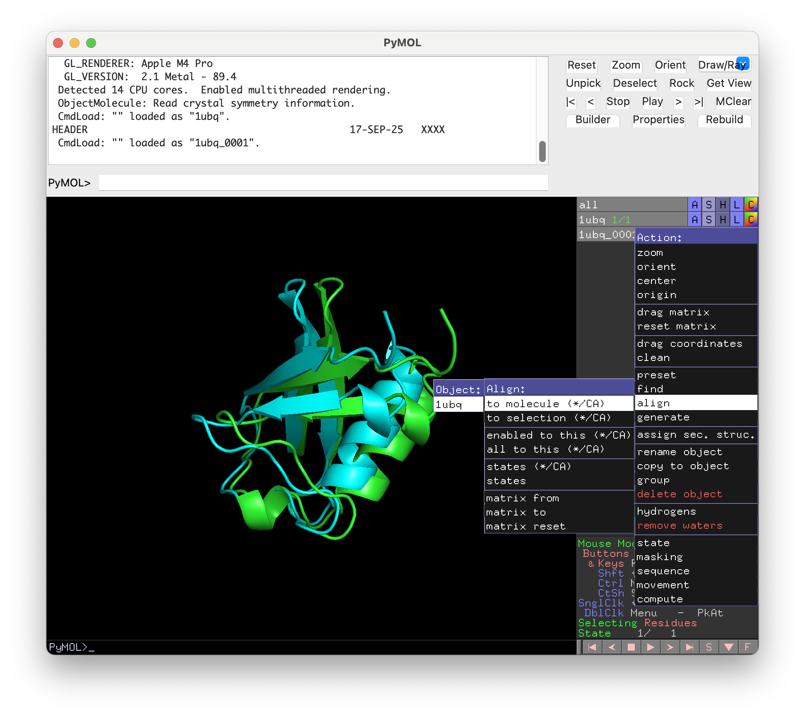

Images can help clarify your tutorial, make it easier to skim for those using it as a reference, and break up the text to make it feel less tedious. 
However, ensuring that an image adds clarity rather than confusion takes some thought and likely some editing. 

For example, say I have a tutorial where I am telling my user to align two proteins in PyMOL.
The written instructions would be: 
> Select the actions menu (A) for 1UBQ_0001.pdb -> align -> to_molecule -> 1ubq
These alone are a bit hard to follow, unless the user is already familiar with this capability of PyMOL, since it relies on the user finding the correct option in each dropdown menu that is opened. 

So let's add an image:

This image shows the only some of the menu options the user is supposed to select, though it does highlight the viewable ones due to how PyMOL's GUI works. It is also unclear where the user should look as the proteins themselves are the most eye-catching, not the menus. 

Let's improve this situation:

We now have two images, one for the action (A) button that was covered in our original image and one showing the rest of the submenus. 
Both images use rectangles in high contrast colors to draw the user's eye to where we want them to look and crops the image to remove unnecessary information. 
When you crop images, make sure to leave enough context so the user knows where the image refers to on their own interface! 
This is why we included so much of the sidebar in the 'Good Image 1'.

Here we just used rectangles to highlight portions of the image, which can be done with many free image editing tools. 
Using arrows or text can also help direct the reader's attention. 

## Accessibility
Many people experience varying levels of colorblindness that can make it difficult to interpret images. 
Pilestone has a [Color Vision Simulator](https://pilestone.com/pages/color-blindness-simulator) that allows you to simulate how your images will look like to people with various types of colorblindness. If you can, it's good practice to feed any images you are going to include in a tutorial or a publication into tools like this to ensure they can be interpreted by as many people as possible.

We also strongly recommend the use of alt-text and descriptive captions. While they are not a replacement for the actual image, they can still impart useful information if the image cannot be viewed. 
